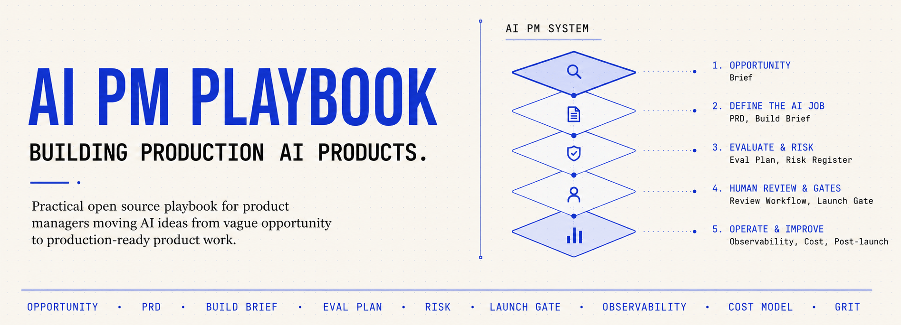

<p align="center">
  
</p>

<p align="center">
  <a href="https://ai-pm-playbook.com"></a>
</p>

<p align="center">
  <a href="LICENSE"></a>
  <a href="#what-an-ai-pm-actually-does"></a>
  <a href="#guides"></a>
  <a href="#case-studies"></a>
</p>

<p align="center"><strong>Ship AI features you can put your name on.</strong><br/>The templates, evals, and launch gates AI PMs use to turn working demos into production calls they own.</p>

Vibe-coding gets you to a demo fast. This playbook helps you make the harder call: whether that demo should become a product, where humans need to stay in the loop, what evidence would make it safe to ship, and when to say "not yet."

Built for PMs working with LLMs, agents, copilots, RAG, and workflow automation.

If useful, a GitHub star helps me know this is worth maintaining.

> **New here?** Start with [A week with the AI PM Playbook](docs/00-walkthrough.md) — a walkthrough of one PM using these artifacts on an actual product, from opportunity brief to roadmap review.

## Choose your path

**I have an idea**

[Before you vibe code](docs/before-you-vibe-code.md) -> [Opportunity brief](templates/ai-opportunity-brief.md) -> [AI PRD](templates/ai-prd.md) -> [Eval plan](templates/ai-eval-plan.md) -> [Launch gate](templates/launch-gate-checklist.md)

Use this path when the problem is still fuzzy and you need to decide whether AI is worth building at all.

**I already built a prototype and now I'm nervous**

[Error analysis](docs/07-error-analysis.md) -> [Eval plan](templates/ai-eval-plan.md) -> [PRD risk table](templates/ai-prd.md#risks-and-mitigations) -> [Observability plan](templates/ai-observability-plan.md) -> [Launch gate](templates/launch-gate-checklist.md)

Use this path when the demo works, but you do not yet know whether the product is safe, measurable, affordable, or ready for users.

## Quick start

1. [Before you vibe code](docs/before-you-vibe-code.md) — answer 8 questions before building
2. [AI opportunity brief](templates/ai-opportunity-brief.md) — decide if AI is worth pursuing and align user, AI job, human control, evals, risk, and cost
3. [AI PRD](templates/ai-prd.md) — define what the AI does, its quality bar, risks, and what happens when it fails
4. [Eval plan](templates/ai-eval-plan.md) — define "good" before trusting model output
5. [Human review workflow](templates/human-review-workflow.md) — decide who validates, corrects, escalates, or blocks AI output before it matters
6. [Launch gate checklist](templates/launch-gate-checklist.md) — make a go/no-go call for pilot, production, or scale
7. [Healthcare intake example](examples/healthcare-intake-assistant/) — see what a "do not launch" recommendation looks like

The [full playbook](ai-pm-playbook.md) has the operating model, evidence hierarchy, readiness scoring, and decision framework.

## When this playbook tells you to stop

"Do not launch" is not a failure state. It is a product decision when the evidence says the blast radius is larger than the team's ability to measure, review, roll back, or operate the AI safely.

Stop or hold when evals are missing, human review is undefined, agent rollback is impossible, data permissioning is unclear, cost exceeds the business case, or legal/security review has not happened for a high-risk workflow. A convincing LLM demo is not evidence that the product can act safely in the real workflow. Use the [Launch Gates guide](docs/04-launch-gates.md) to make that call with evidence.

## Who this is for

- PMs shipping AI features from prototype to production
- Founders deciding which AI workflows are worth building
- Product leaders reviewing whether an AI roadmap is credible
- Engineering, design, and legal partners who want clearer AI product artifacts

This is not a prompt pack or a strategy deck. There are no starter apps.

## What an AI PM actually does

Most of these jobs didn't exist three years ago. Each one has a template.

| Skill | What it means | Artifact |
|-------|---------------|----------|
| Opportunity assessment | Decide whether AI is worth pursuing and align user, AI job, human control, evals, risk, and cost | [Opportunity Brief](templates/ai-opportunity-brief.md) |
| AI job definition | Specify what the AI does, its constraints, and its fallback behavior | [AI PRD](templates/ai-prd.md) |
| Eval design | Define "good" before trusting model output | [Eval Plan](templates/ai-eval-plan.md) |
| Risk management | What can go wrong, how bad is it, what do we do about it | [PRD risk table](templates/ai-prd.md#risks-and-mitigations) + [Launch Gate](templates/launch-gate-checklist.md) |
| Human-in-the-loop design | Decide who validates, corrects, escalates, or blocks AI output before it matters | [Review Workflow](templates/human-review-workflow.md) |
| Unit economics | Cost per workflow and margin impact at scale | [Cost Model](templates/ai-cost-model.md) |
| Launch gating | Go/no-go calls using evidence | [Launch Gate Checklist](templates/launch-gate-checklist.md) |
| Observability | Monitor quality, drift, and cost in production | [Observability Plan](templates/ai-observability-plan.md) |
| Post-launch review | What actually happened vs. what we expected | [Observability Plan](templates/ai-observability-plan.md#weekly-post-launch-review) |
| Optional handoff and operations | Build handoff, meeting review, and prompt change control | [Optional templates](templates/optional/) |

## Guides

Twelve guides on the parts of AI product management where most teams get stuck.

| Guide | What it covers |
|-------|----------------|
| [Before You Vibe Code](docs/before-you-vibe-code.md) | Eight questions to answer before turning an AI idea into a demo |
| [Walkthrough](docs/00-walkthrough.md) | A week with the playbook: one PM, one product, five artifacts |
| [Eval Design](docs/01-eval-design.md) | Building evals that catch real failures, including the ones you miss in demos |
| [Agentic Products](docs/02-agentic-products.md) | How to spec agents vs. chatbots vs. copilots |
| [Operating AI Products](docs/03-operating-ai-products.md) | Human review, safety, observability, and cost discipline after the demo works |
| [Launch Gates](docs/04-launch-gates.md) | How to say "do not launch" with evidence |
| [Prompt Craft](docs/05-prompt-craft.md) | Treating prompts as product surfaces |
| [Bad to Good AI PRD](docs/06-bad-to-good-ai-prd.md) | Turning a vague AI assistant brief into a buildable PRD slice |
| [Error Analysis](docs/07-error-analysis.md) | Reading traces, labeling failures, and deciding which evals are worth automating |
| [Artifact Flow Map](docs/08-artifact-flow-map.md) | What artifact comes when, who owns it, and what decision it unlocks |
| [Agent PM Starter Pack](docs/09-agent-pm-starter-pack.md) | Tool boundaries, autonomy, rollback, trajectory evals, cost ceilings, and handoff |
| [AI-Native PM Loop](docs/10-ai-native-pm-loop.md) | Build small PM agents, trace behavior, create evals from traces, and improve safely |

## Case studies

Three worked examples. Each one includes an opportunity brief, PRD, eval plan, launch gate assessment, and a scored readiness recommendation. The customer support example also includes a week-2 post-launch review to show the operating loop after pilot launch.

| Case study | Risk | Recommendation |
|-----------|------|----------------|
| [Customer Support Copilot](examples/customer-support-copilot/) | Medium | Pilot after blockers resolved |
| [Sales Call CRM Assistant](examples/sales-call-crm-assistant/) | Medium | Pilot after blockers resolved |
| [Healthcare Intake Assistant](examples/healthcare-intake-assistant/) | High | Prototype only |

The examples are synthetic but realistic. They show how the artifacts reason through tradeoffs rather than filling in blanks.

## Portfolio interview prompts

Use these artifacts to answer common AI PM interview questions with concrete examples.

| Interview question | Where to point |
|--------------------|----------------|
| How do you decide if an AI feature is worth building? | [Opportunity Brief](templates/ai-opportunity-brief.md) + [Healthcare Intake opportunity](examples/healthcare-intake-assistant/opportunity-brief.md) |
| How do you define quality for LLM output? | [Eval Plan](templates/ai-eval-plan.md) + [Customer Support eval](examples/customer-support-copilot/eval-plan.md) |
| How do you handle hallucination risk? | [AI PRD risk table](templates/ai-prd.md#risks-and-mitigations) + [Customer Support launch gate](examples/customer-support-copilot/launch-gate.md) |
| How do you decide not to launch? | [Launch Gates guide](docs/04-launch-gates.md) + [Healthcare Intake launch gate](examples/healthcare-intake-assistant/launch-gate.md) |
| How do you operate after launch? | [Observability Plan](templates/ai-observability-plan.md) + [Week-2 post-launch review](examples/customer-support-copilot/post-launch-review-week-2.md) |

## Repo structure

```
ai-pm-playbook.md          # Full playbook: operating model, scoring, gates
templates/                  # 7 core PM artifacts plus 3 optional templates
docs/                       # 12 reference guides (including walkthrough)
examples/                   # 3 scored case studies, plus one post-launch review example
schema/                     # JSON schema for readiness assessments
```

## Companion framework

[GRIT](https://github.com/zaidazmi/GRIT) covers the engineering side: how AI-assisted code gets specified, tested, and reviewed. This playbook covers the product side: what gets built, why, and when it is ready.

## License

[MIT](LICENSE)
